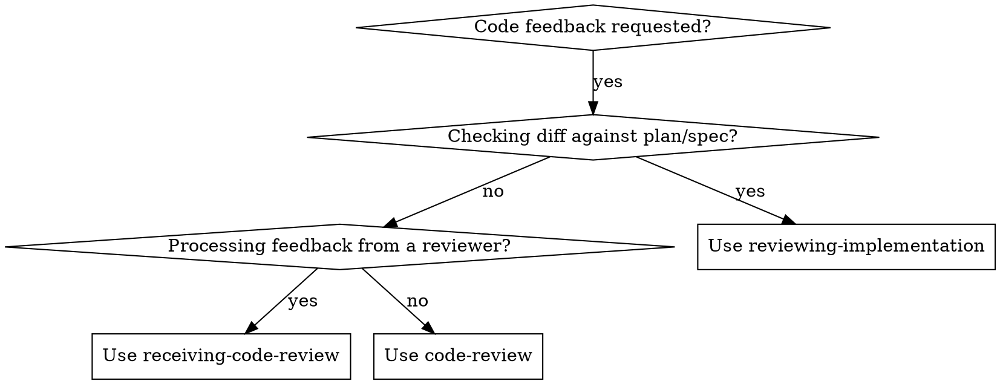

# Code Review Skill

Structured skill for reviewing functions, features, or code blocks with targeted, actionable feedback.

---

## When to Use

- User shares a function, method, class, or snippet and asks for feedback
- User says "review", "audit", "check", "look over", "critique", "improve", "clean up", or "what's wrong with"
- User asks about bugs, edge cases, performance, security, or readability
- User shares a PR diff or change and wants code quality evaluated
- User says "is this good?" or "can this be better?" about their code
- User pastes code with no explicit request — infer that feedback is desired
- User asks "does this look right?" or "spot any issues?" or "give me feedback on this"

### When NOT to Use

- **Plan compliance / spec validation:** Use `reviewing-implementation` when verifying whether a diff meets all tasks and acceptance criteria from a plan document.
- **Handling incoming review comments:** Use `receiving-code-review` when processing review feedback received from an external reviewer on your own changes.
- **Dead code analysis:** Use `finding-dead-code` when hunting for unused variables, unreachable branches, or dead imports across a repository.
- **Architecture design / new code:** Use `brainstorming` or `writing-plans` when designing new features or components from scratch.

### Routing Decision Flow



## Red Flags & Anti-Rationalizations

| Rationalization | Reality |
|---|---|
| "The user phrased it casually ('looks good?'), so I'll just say LGTM." | Casual phrasing requires the same structured 6-dimension pass. |
| "It's only a 5-line helper function, no need to check edge cases." | Short helpers frequently harbor injection, mutation, or off-by-one bugs. |
| "I'll skip 'What's Working Well' to save tokens." | Mandatory section: positive reinforcement prevents regressions in solid logic. |
| "I'll explain the fix in prose without showing the corrected snippet." | Always provide concrete, copy-pasteable replacement code for non-trivial fixes. |
| "I'll mix style nitpicks into the critical bug section." | Strict separation: critical correctness/security issues must lead and stay distinct from style suggestions. |

---

## Review Process

### Step 1 — Understand the Context

Before diving in, quickly assess:

1. **Language & runtime** — Python, TypeScript, Rust, Go, etc.
2. **Purpose** — What is this function/feature supposed to do?
3. **Scope** — Full module, single function, class method, or PR diff?
4. **User's priority** — Bugs, performance, security, style, or general quality? Infer from context; only ask if genuinely unclear.
5. **Environment** — Production, script, prototype, or test code? Calibrate strictness accordingly.
6. **Depth** — Use the table under [Review Depth](#review-depth) to decide how deep to go.

---

### Step 2 — Structured Review Pass

Evaluate in order of severity. Skip dimensions with nothing worth flagging.

#### 🔴 Correctness & Bugs
- Logic errors, off-by-one mistakes, wrong conditions
- Unhandled edge cases (empty input, null/None, negative numbers, overflow, NaN, empty collections)
- Incorrect assumptions about input, state, or ordering
- Race conditions or mutation bugs
- Incorrect return types or missing return paths
- Unintended side effects on shared/mutable state

#### 🟠 Security
- Insecure defaults (open CORS, weak/missing auth, insecure cipher choices)
- Privilege escalation risks or missing authorization checks
- Insecure randomness for security-sensitive operations (e.g., `Math.random()` for tokens)
- Denial-of-service vectors (unbounded input, regex catastrophic backtracking, no rate limiting)
- Timing attacks in comparison logic (e.g., non-constant-time secret comparison)
- SQL/command injection, path traversal, or unsafe deserialization

#### 🟡 Performance
- Unnecessary nested loops (O(n²) where O(n) is achievable)
- Repeated expensive operations that could be memoized or cached
- Memory leaks, unbounded growth, or large unnecessary allocations
- Blocking I/O in async/concurrent contexts
- Missing database indices or N+1 query patterns
- Premature optimization — flag if clarity is sacrificed for negligible gain

#### 🔵 Reliability & Error Handling
- Errors silently swallowed or logged but not acted on
- Missing retries or fallbacks for transient failures
- Functions that can panic/throw on predictable inputs without documentation
- Cascading failure risks (one bad call takes down a larger flow)
- Timeouts missing on network or I/O calls
- Lack of input validation before processing

#### 🟢 Readability & Maintainability
- Confusing variable or function names
- Functions doing too many things (single responsibility violation)
- Magic numbers or hardcoded strings that should be named constants
- Missing or misleading comments/docstrings on non-obvious logic
- Dead code or unused variables
- Overly deep nesting — flatten with early returns or extracted helpers
- Abstraction level mismatches (mixing high-level orchestration with low-level detail)

#### ⚪ Style & Conventions
- Inconsistent naming conventions (camelCase vs snake_case)
- Non-idiomatic patterns for the language
- Formatting issues (flag only if significant or no automated tooling in place)

---

### Step 3 — Output Format

Use this template for all reviews:

```
## Code Review: `<function/class/file name>`

### Summary
<2–3 sentences. Honest and constructive. Lead with the single most important finding.>

### Issues Found

#### 🔴 [Short title] — Correctness  ← use the right emoji/category label
**Line(s):** X–Y  ← omit if not applicable
**Problem:** <What's wrong and why it matters.>
**Fix:**
```lang
<corrected snippet>
```

#### 🟡 [Short title] — Performance
... (repeat per issue, ordered by severity)

### What's Working Well
<Genuine, specific positives — this section is mandatory. Note good structure, naming, edge case handling, clever logic, etc.>

### Recommended Changes (Priority Order)
1. <Most critical fix>
2. <Next>
3. ...

### Overall Rating
<Needs significant work | Needs minor fixes | Good with suggestions | Excellent>
```

**Formatting rules:**
- One issue block per distinct problem — don't batch unrelated issues together
- Always show corrected code for any non-trivial fix
- Order issues within each section by impact, not line number
- Use plain language; avoid jargon unless the user has demonstrated familiarity

---

## Review Depth

| Request phrasing | Depth |
|---|---|
| "Quick look", "anything obvious?" | Surface scan — 🔴 and 🟠 only |
| "Review this" (default) | Full review across all dimensions |
| "Deep dive", "thorough review", "full audit" | Full review + refactors + idiomatic alternatives + test gap analysis |
| "Security audit" | 🟠 Security + 🔴 Correctness only |
| "Performance review" | 🟡 Performance + 🔴 Correctness only |
| "Refactor this" | 🟢 Readability, structure, abstraction — preserve behavior |
| "Style / lint check" | ⚪ Style + 🟢 Readability only |

When in doubt, do a full review. It's easier to ignore extra findings than to ask for a re-review.

---

## Tone & Delivery

- **Specific, not vague.** Show exactly what to change and why — never just "this could be cleaner."
- **Prioritize ruthlessly.** Don't bury a critical bug under style nitpicks. Lead with what matters.
- **Show corrected code** for every non-trivial fix. A snippet beats a paragraph of explanation.
- **Don't over-flag.** Minor style preferences should be marked as optional or skipped entirely.
- **Acknowledge good work.** "What's Working Well" is not optional — skip only if the code is genuinely unusable.
- **Never be condescending.** Assume reasonable choices were made given context; explain *why* a change helps.
- **Calibrate to scope.** A throwaway script ≠ a payment processor. Match strictness to stakes.
- **Suggest, don't mandate.** Frame style/design feedback as options, not commands.

---

## Test Coverage Assessment (deep reviews only)

Include this section only for "deep dive" requests or when test coverage is clearly inadequate.

- Are there obvious untested paths (error branches, edge cases, empty inputs)?
- Are tests tightly coupled to implementation details, making them brittle?
- Is the code structured in a way that makes testing hard (hidden dependencies, no dependency injection)?
- Suggest specific test cases with concrete input/output examples — not just "add more tests."

---

## Language-Specific Checklists

Apply the relevant checklist during Step 2. Skip items that don't apply to the reviewed scope.

### Python
- [ ] `is None` / `is not None` — not `== None`
- [ ] List/dict comprehensions over explicit loops where clear
- [ ] Context managers (`with`) for file/network/resource handling
- [ ] f-strings over `.format()` or `%`
- [ ] Type hints on all public functions
- [ ] Specific exceptions, not bare `except:` or `except Exception:`
- [ ] `__all__` defined for public modules
- [ ] Generators for large sequences instead of materializing full lists
- [ ] `dataclasses` or `pydantic` over raw dicts for structured data
- [ ] `pathlib` over `os.path` for file operations

### JavaScript / TypeScript
- [ ] `const`/`let` only — no `var`
- [ ] `async`/`await` over raw `.then()` chains
- [ ] Specific TS types — avoid `any`; prefer `unknown` + narrowing
- [ ] Error handling in every async function (`try/catch` or `.catch()`)
- [ ] `===` not `==` — no implicit coercion
- [ ] No side effects in pure utility functions
- [ ] No floating unhandled promises
- [ ] Optional chaining (`?.`) and nullish coalescing (`??`) where appropriate
- [ ] No direct DOM mutation inside framework components (React, Vue, etc.)
- [ ] `useEffect` dependency arrays complete and correct (React)

### SQL
- [ ] Parameterized queries — no string concatenation with user input
- [ ] Indexes on columns used in `WHERE`, `JOIN`, `ORDER BY`
- [ ] No `SELECT *` in production queries
- [ ] Transactions for multi-statement operations
- [ ] `NULL` handling considered in all comparisons
- [ ] Pagination (`LIMIT`/`OFFSET` or keyset) on large result sets
- [ ] CTEs or subqueries to avoid repeated expressions

### Go
- [ ] Errors checked — not silently ignored with `_`
- [ ] Goroutines have clear ownership and cancellation via `context`
- [ ] No data races — shared state properly synchronized
- [ ] Interfaces small and purposeful (1–3 methods ideally)
- [ ] `defer` used appropriately for cleanup
- [ ] `context.Context` threaded through all I/O-bound calls
- [ ] Struct fields exported intentionally, not by default

### Java / Kotlin
- [ ] Null safety handled (`Optional` in Java / `?.` and `!!` used carefully in Kotlin)
- [ ] Resources closed properly (`try`-with-resources / `.use {}`)
- [ ] No raw generic types
- [ ] Immutability preferred (`val`, `final`)
- [ ] Thread safety considered for all shared state
- [ ] Stream API used idiomatically — no stateful lambdas

### Rust
- [ ] Ownership/borrowing correct — no unnecessary `.clone()`
- [ ] `unwrap()`/`expect()` only where a panic is truly acceptable
- [ ] Errors propagated with `?` over nested `match`
- [ ] `Vec` capacity pre-allocated when size is known
- [ ] Lifetimes explicit where inference would be confusing
- [ ] Known `clippy` lints addressed

---

## Example Review

**User shares:**
```python
def get_user(id):
    conn = psycopg2.connect(DB_URL)
    result = conn.execute(f"SELECT * FROM users WHERE id = {id}")
    return result.fetchone()
```

**Output:**

---

## Code Review: `get_user`

### Summary
This function has a critical SQL injection vulnerability and a connection leak that must be fixed before it can be used in any environment. The core logic is otherwise simple and clear.

### Issues Found

#### 🔴 SQL Injection — Security
**Line:** 3  
**Problem:** String interpolation into SQL allows an attacker to pass `id = "1; DROP TABLE users"` or similar, executing arbitrary SQL against the database.  
**Fix:**
```python
cur.execute("SELECT * FROM users WHERE id = %s", (user_id,))
```

#### 🔴 Connection Never Closed — Resource Leak
**Line:** 2  
**Problem:** The connection is opened but never closed. Under load this exhausts the connection pool and may crash the service.  
**Fix:**
```python
def get_user(user_id: int) -> tuple | None:
    with psycopg2.connect(DB_URL) as conn:
        with conn.cursor() as cur:
            cur.execute("SELECT * FROM users WHERE id = %s", (user_id,))
            return cur.fetchone()
```

#### 🟢 Parameter Name Shadows Built-in — Readability
**Line:** 1  
**Problem:** `id` is a Python built-in. Rename to `user_id` to avoid shadowing and improve clarity.

#### ⚪ Missing Type Hints — Style
**Line:** 1  
**Problem:** Public functions should declare parameter and return types for documentation and static analysis.

### What's Working Well
- Short function with a single, clear purpose.
- Returns `None` naturally via `fetchone()` when no user is found — no extra error handling needed.

### Recommended Changes (Priority Order)
1. Fix SQL injection with parameterized queries — **critical security fix**
2. Use context managers to guarantee connection closure
3. Rename `id` → `user_id` to avoid shadowing the built-in
4. Add type hints to public function signature

### Overall Rating
**Needs significant work** — security-critical issues must be resolved before any use
