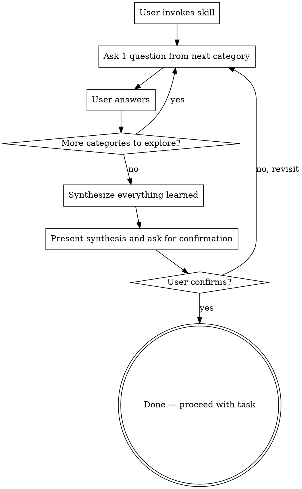

# Requirements Gathering

## Overview

Structured requirements gathering through one-at-a-time questioning. When a user asks you to help them clarify what they need, you systematically explore 8 question categories, one per turn, then synthesize what you've learned back to them for confirmation.

**Core principle:** One question per turn. Always synthesize and confirm before proceeding to implementation.

## When to Use

- User says "ask me questions" or "what do you need to know"
- User says "help me clarify what I need" or "figure out what I'm trying to do"
- User says "gather requirements for..." or "help me spec this out"
- User gives a vague or underspecified request and asks for your help defining it
- User asks "what questions do you have?" about their idea

**When NOT to use:**
- User has already provided a complete, well-defined specification
- User is asking a simple factual question
- User is just having a casual conversation
- The skill hasn't been explicitly invoked by the user

## Question Framework

Explore these categories **in order**, one question per turn. Do NOT ask multiple questions at once. Wait for the answer before moving to the next category.

### 1. Purpose / Goal
"What problem are you trying to solve?" / "What's the main goal here?"

### 2. Scope / Boundaries
"What's in scope? What's explicitly out of scope?" / "Where does this start and end?"

### 3. Inputs / Outputs
"What data or information goes in? What comes out?" / "What format should inputs and outputs be in?"

### 4. Users / Stakeholders
"Who will use this?" / "Are there different types of users with different needs?"

### 5. Success Criteria
"How will you know this is working?" / "What does 'done' look like?"

### 6. Constraints
"Any constraints on tech, time, budget, or resources?" / "Any must-use technologies?"

### 7. Dependencies / Interfaces
"Does this need to integrate with existing systems?" / "What does it depend on?"

### 8. Priorities / Trade-offs
"What's most important: speed, quality, cost, or features?" / "What can we cut if needed?"

## Process

**Rules:**
- ONE question per turn. Never bundle 2+ questions.
- Go through categories in order. Don't skip any, even if the answer seems "obvious."
- Keep questions simple and direct. Don't over-explain or justify why you're asking.
- After all 8 categories, write a brief synthesis of what you've learned.
- Present the synthesis and ask: "Does this match your understanding? Any corrections?"
- Only proceed to implementation after the user confirms.
- If user says the synthesis is wrong, re-ask the relevant categories and update.

## Example Interaction

**User:** "Ask me some questions to figure out what I need. I want to build a notification system."

**You:** "What problem are you trying to solve with this notification system? What kind of notifications do you need to send?"

**User:** "I need to alert users when their invoices are due and when payments are received."

**You:** "Got it. What's in scope versus out of scope? For example, are there any notification types you explicitly don't need?"

**User:** "Just invoice due and payment received. No marketing, no system alerts."

**You:** "What data goes into triggering these notifications, and what should come out? For example, what triggers each notification and what info should the message contain?"

(*Continue one question per turn through the framework...*)

**You (after all categories):** "Here's what I understand so far:

- **Purpose:** Alert customers about invoice due dates and payment receipts
- **Scope:** Customer-facing only — invoice due and payment confirmation. No marketing or system alerts.
- **Inputs:** Billing system events (invoice generated, payment received). **Outputs:** Email notifications with invoice details.
- **Users:** End customers only. No internal staff.
- **Success criteria:** Notifications arrive within 1 minute of the triggering event.
- **Constraints:** Must integrate with existing billing system. No additional budget.
- **Dependencies:** Existing billing system API. Email service provider.
- **Priority:** Reliability over delivery speed.

Does this match your understanding? Any corrections before I proceed?"

## Common Mistakes

| Mistake | Fix |
|---------|-----|
| Asking multiple questions at once | Stick to ONE question per turn |
| Skipping categories that seem "obvious" | Ask anyway — obvious to you may not be to the user |
| Moving to implementation without synthesizing | Always synthesize and confirm first |
| Assuming you understand without checking | Confirmation gate is mandatory, not optional |
| Over-explaining each question | Ask simply and directly — let the user fill in details |
| Hinting at solutions before all requirements gathered | Solutions come AFTER requirements, not during |
